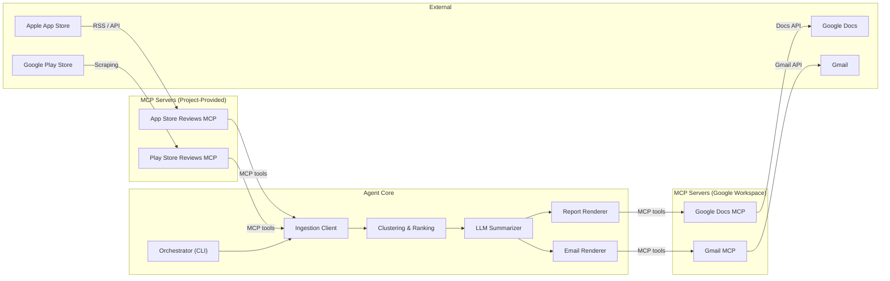
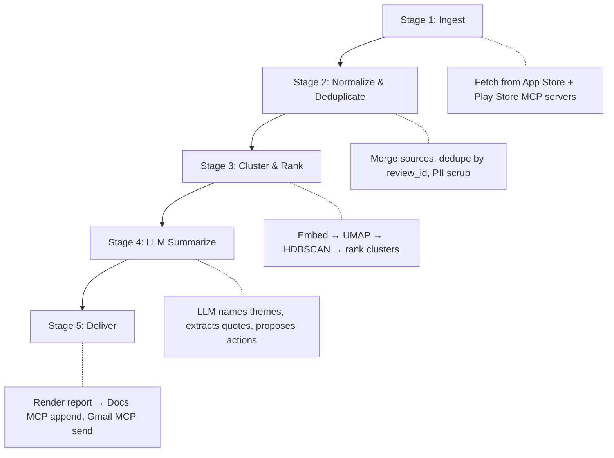
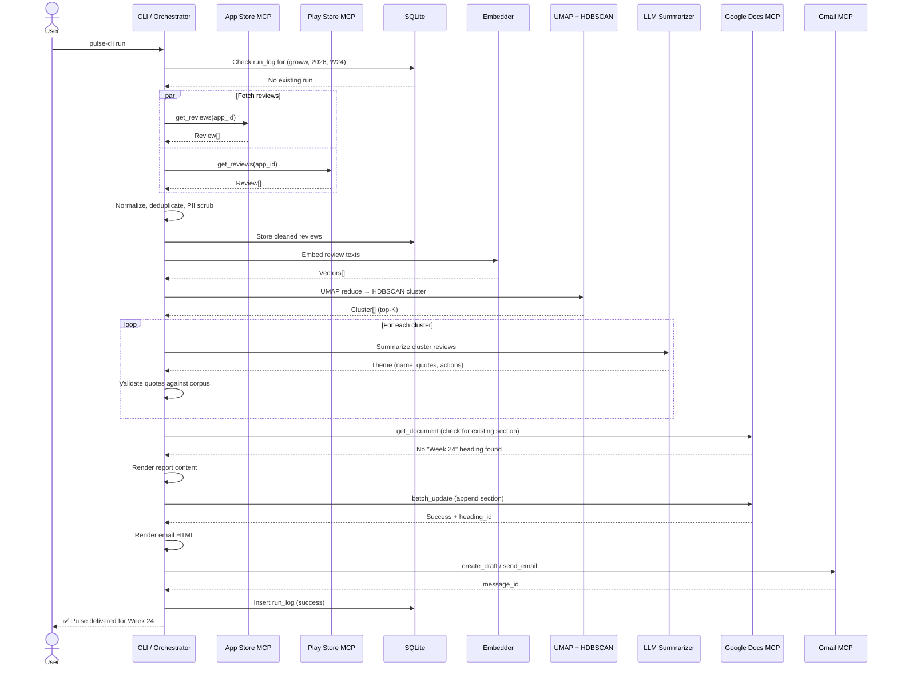

# Weekly Product Review Pulse — Architecture

> **Companion to:** [problemStatement.md](file:///d:/App%20Review%20AI/docs/problemStatement.md)
> **Target product:** Groww
> **Last updated:** 2026-06-09

---

## 1. System Overview

The system is an **MCP-native pipeline** that ingests public app reviews, clusters them into themes, generates an insight report, and delivers it to stakeholders—all without a single direct REST API call from the core agent.



### Design Principles

| Principle | How It's Applied |
|---|---|
| **MCP everywhere** | All I/O (reviews in, reports out) flows through MCP tool calls. The agent never holds API credentials. |
| **Separation of concerns** | Ingestion, reasoning, rendering, and delivery are independent modules. |
| **Idempotent by default** | Every run is keyed by `(product, iso_week)`. Duplicate runs are no-ops. |
| **Safety first** | PII scrubbing before LLM; reviews treated as data, never as instructions; cost/token budgets per run. |

---

## 2. MCP Server Architecture

The system uses **four MCP servers** — two project-provided (review ingestion) and two external (Google Workspace delivery).

### 2.1 App Store Reviews MCP (Project-Provided)

Fetches Apple App Store reviews for Groww via the public iTunes Customer Reviews RSS/JSON feed.

**Exposed Tools:**

| Tool | Description | Parameters | Returns |
|---|---|---|---|
| `get_reviews` | Fetch reviews for a given app | `app_id: string`, `country: string = "in"`, `page: int = 1`, `sort_by: "mostRecent" \| "mostHelpful"` | `Review[]` |
| `get_app_info` | Fetch app metadata | `app_id: string`, `country: string = "in"` | `AppInfo` |

**Data source:** `https://itunes.apple.com/{country}/rss/customerreviews/id={app_id}/json`

**Review schema returned:**

```json
{
  "review_id": "string",
  "source": "app_store",
  "app_id": "string",
  "author": "string",
  "rating": 1-5,
  "title": "string",
  "body": "string",
  "date": "ISO 8601",
  "version": "string",
  "country": "string"
}
```

---

### 2.2 Play Store Reviews MCP (Project-Provided)

Fetches Google Play Store reviews for Groww via scraping (e.g. `google-play-scraper` npm library or equivalent Python package).

**Exposed Tools:**

| Tool | Description | Parameters | Returns |
|---|---|---|---|
| `get_reviews` | Fetch reviews for a given app | `app_id: string`, `lang: string = "en"`, `country: string = "in"`, `count: int = 200`, `sort: "newest" \| "rating" \| "helpfulness"` | `Review[]` |
| `get_app_info` | Fetch app metadata | `app_id: string`, `lang: string = "en"`, `country: string = "in"` | `AppInfo` |

**Review schema returned:**

```json
{
  "review_id": "string",
  "source": "play_store",
  "app_id": "string",
  "author": "string",
  "rating": 1-5,
  "title": "string | null",
  "body": "string",
  "date": "ISO 8601",
  "version": "string | null",
  "thumbs_up": "int",
  "reply_text": "string | null",
  "reply_date": "ISO 8601 | null"
}
```

---

### 2.3 Google Docs MCP (External)

Manages the running pulse document per product. Used via its published tool surface.

**Tools Used:**

| Tool | Purpose |
|---|---|
| `create_document` | One-time creation of the pulse doc (if it doesn't exist). |
| `get_document` | Read current doc to check for existing section anchors (idempotency). |
| `batch_update` | Append a new dated section (heading + body) to the end of the doc. |

**Document Convention:**

- **One document per product:** *"Weekly Review Pulse — Groww"*
- **Section heading format:** `## Week {ISO_WEEK} — {START_DATE} to {END_DATE}`
- **Anchor ID:** The heading text itself serves as the stable anchor for deep-linking and idempotency checks.

---

### 2.4 Gmail MCP (External)

Sends stakeholder notification emails with a link back to the Google Doc section.

**Tools Used:**

| Tool | Purpose |
|---|---|
| `create_draft` | Create an email draft (used in staging/dev mode). |
| `send_email` | Send the notification email (production mode). |

**Email Convention:**

- **Subject:** `Groww Review Pulse — Week {ISO_WEEK}`
- **Body:** HTML email with top themes as bullet points + a *"Read full report →"* CTA linking to the Doc heading.
- **Staging behavior:** Draft-only until explicit production flag.

---

## 3. Data Pipeline

The end-to-end pipeline executes in five sequential stages:



### Stage 1 — Ingest

1. Call `App Store Reviews MCP → get_reviews` with Groww's App Store ID.
2. Call `Play Store Reviews MCP → get_reviews` with Groww's Play Store ID.
3. Filter reviews to the configured time window (default: last 8–12 weeks from run date).
4. Store raw reviews in a local staging area (SQLite or Parquet).

**Groww App IDs:**

| Store | App ID |
|---|---|
| Apple App Store | `1404684361` |
| Google Play | `com.nextbillion.groww` |

---

### Stage 2 — Normalize & Deduplicate

1. **Normalize** both sources into a unified `Review` schema (see §6 Data Models).
2. **Deduplicate** by `(source, review_id)` composite key.
3. **PII scrub** — Strip emails, phone numbers, and names from review text using regex + optional NER pass.
4. **Persist** cleaned reviews for audit trail.

---

### Stage 3 — Cluster & Rank

1. **Embed** review text using a local multilingual sentence-transformer model (e.g. `paraphrase-multilingual-MiniLM-L12-v2`) to properly support Hinglish / Romanized Hindi.
2. **Reduce dimensions** with UMAP (n_components=5, metric=cosine).
3. **Cluster** with HDBSCAN (min_cluster_size tuned to review volume).
4. **Rank clusters** by size and distance from neutral sentiment (e.g., `Score = cluster_size × (1 + abs(3 - avg_rating))`) to properly rank both positive and negative themes.
5. **Select top-K clusters** (default K=5) for summarization.

**Output:** A list of `Cluster` objects, each containing member review IDs, centroid embedding, and size.

---

### Stage 4 — LLM Summarize

For each top-K cluster, prompt the LLM (Groq via `llama-3.3-70b-versatile`) with a sampled subset of the cluster's review texts to strictly respect the 12K Tokens-Per-Minute limit:

**Prompt structure:**

```
You are analyzing app reviews for Groww.
Below are {N} reviews that share a common theme.

<reviews>
{review_texts}
</reviews>

Produce:
1. Theme name (3-6 words)
2. Theme description (1-2 sentences)
3. 2-3 verbatim quotes (MUST appear exactly in the reviews above)
4. 1-2 action ideas for the product team

Output as JSON.
```

**Validation:**

- Every returned quote is substring-matched against the original review corpus. Hallucinated quotes are dropped.
- Strict Rate Limiter is enforced for Groq API limits (30 Requests-Per-Minute, 12K Tokens-Per-Minute, 100K Tokens per day).

---

### Stage 5 — Deliver

#### 5a. Google Docs Append

1. **Idempotency check:** Call `Google Docs MCP → get_document`, parse headings, check if `Week {ISO_WEEK}` section already exists.
   - If exists → log, skip, return existing section link.
   - If not → proceed.
2. **Build section content:** Render themes, quotes, and action ideas into Google Docs-compatible structured content (headings, bullets, bold text).
3. **Append:** Call `Google Docs MCP → batch_update` to insert the new section at the end of the document.
4. **Extract section link:** Construct heading deep link: `https://docs.google.com/document/d/{DOC_ID}/edit#heading=h.{HEADING_ID}`

#### 5b. Gmail Notification

1. **Idempotency check:** Query local run log for `(groww, iso_week, email_sent=true)`.
   - If already sent → log, skip.
   - If not → proceed.
2. **Render email:** HTML email with:
   - Subject: `Groww Review Pulse — Week {ISO_WEEK}`
   - Body: Top themes as bullet summary + "Read full report →" link to the Doc section.
3. **Send or draft:**
   - Production: `Gmail MCP → send_email`
   - Staging: `Gmail MCP → create_draft`
4. **Record:** Store `message_id` / `draft_id` in run log.

---

## 4. Idempotency Strategy

Every pipeline run is uniquely keyed by:

```
run_key = (product="groww", iso_year=YYYY, iso_week=WW)
```

| Check Point | Mechanism | Effect of Duplicate |
|---|---|---|
| **Doc section** | Parse doc headings for `Week {WW}` match | Skip append, return existing link |
| **Email** | Local run log tracks `(run_key, message_id)` | Skip send |
| **Clustering** | Deterministic seed for UMAP/HDBSCAN | Same input → same clusters |

**Run log schema** (SQLite):

```sql
CREATE TABLE run_log (
    id              INTEGER PRIMARY KEY AUTOINCREMENT,
    product         TEXT NOT NULL,
    iso_year        INTEGER NOT NULL,
    iso_week        INTEGER NOT NULL,
    run_started_at  TEXT NOT NULL,       -- ISO 8601
    run_finished_at TEXT,
    status          TEXT NOT NULL,       -- 'running' | 'success' | 'failed'
    reviews_fetched INTEGER,
    clusters_found  INTEGER,
    doc_id          TEXT,
    doc_heading_id  TEXT,
    doc_section_url TEXT,
    email_message_id TEXT,
    email_mode      TEXT,               -- 'sent' | 'draft' | 'skipped'
    error_message   TEXT,
    UNIQUE(product, iso_year, iso_week)
);
```

---

## 5. Safety & Quality Controls

### 5.1 PII Scrubbing

Applied at **Stage 2** (before clustering/LLM) and verified again at **Stage 5** (before publishing).

| Pattern | Regex / Method |
|---|---|
| Email addresses | `\b[A-Za-z0-9._%+-]+@[A-Za-z0-9.-]+\.[A-Z]{2,}\b` |
| Phone numbers | `\b(\+?\d{1,3}[-.\s]?)?\(?\d{2,4}\)?[-.\s]?\d{3,4}[-.\s]?\d{3,4}\b` |
| Names in reviews | Optional NER pass (spaCy `en_core_web_sm`) to redact `PERSON` entities |

Scrubbed text replaces matches with `[REDACTED]`.

### 5.2 Prompt Injection Defense

- Reviews are injected into prompts inside `<reviews>` XML delimiters with a system prompt instructing the LLM to treat content within those tags as **data only, never as instructions**.
- No user-facing input is concatenated into system prompts.

### 5.3 Cost Controls & Rate Limits

| Guard | Default | Configurable |
|---|---|---|
| Groq Requests per minute (RPM) | 30 | ✅ |
| Groq Tokens per minute (TPM) | 12,000 | ✅ |
| Max total tokens per run | 100,000 | ✅ |
| Reviews sampled per cluster prompt | 20 | ✅ |
| Max reviews ingested | 2,000 | ✅ |
| LLM call timeout | 60s | ✅ |

---

## 6. Data Models

### Unified Review

```typescript
interface Review {
  review_id: string;          // Unique ID from the source platform
  source: "app_store" | "play_store";
  app_id: string;
  rating: number;             // 1–5
  title: string | null;
  body: string;               // PII-scrubbed after Stage 2
  date: string;               // ISO 8601
  version: string | null;
  country: string;
  raw_body: string;           // Original text (stored locally, never sent to LLM)
}
```

### Cluster

```typescript
interface Cluster {
  cluster_id: number;
  review_ids: string[];
  size: number;
  centroid: number[];         // Embedding vector
  avg_rating: number;
  date_range: { earliest: string; latest: string };
}
```

### Theme (LLM Output)

```typescript
interface Theme {
  theme_name: string;         // e.g. "App performance & bugs"
  description: string;
  quotes: ValidatedQuote[];   // Each verified against corpus
  action_ideas: string[];
  cluster_id: number;
  review_count: number;
}

interface ValidatedQuote {
  text: string;               // Exact substring from a real review
  review_id: string;          // Source review for traceability
  rating: number;
}
```

### Pulse Report

```typescript
interface PulseReport {
  product: string;
  iso_year: number;
  iso_week: number;
  period: { start: string; end: string };
  generated_at: string;       // ISO 8601
  themes: Theme[];
  total_reviews_analyzed: number;
  source_breakdown: {
    app_store: number;
    play_store: number;
  };
}
```

---

## 7. Project Structure

```
App Review AI/
├── docs/
│   ├── problemStatement.md
│   ├── problemStatement.txt
│   └── architecture.md          ← this file
│
├── mcp-servers/
│   ├── appstore-reviews/        ← App Store Reviews MCP server
│   │   ├── src/
│   │   │   ├── server.ts        # MCP server entry point
│   │   │   ├── tools.ts         # get_reviews, get_app_info
│   │   │   └── client.ts        # iTunes RSS fetch logic
│   │   ├── package.json
│   │   └── tsconfig.json
│   │
│   └── playstore-reviews/       ← Play Store Reviews MCP server
│       ├── src/
│       │   ├── server.ts        # MCP server entry point
│       │   ├── tools.ts         # get_reviews, get_app_info
│       │   └── scraper.ts       # Play Store scraping logic
│       ├── package.json
│       └── tsconfig.json
│
├── src/
│   ├── cli.ts                   # CLI entry point & orchestrator
│   ├── config.ts                # Configuration & defaults
│   │
│   ├── ingestion/
│   │   ├── ingest.ts            # Calls MCP servers, merges reviews
│   │   └── normalize.ts         # Unified schema, dedup, PII scrub
│   │
│   ├── analysis/
│   │   ├── embed.ts             # Sentence embeddings
│   │   ├── cluster.ts           # UMAP + HDBSCAN
│   │   └── summarize.ts         # LLM prompting & quote validation
│   │
│   ├── rendering/
│   │   ├── docs-renderer.ts     # Structured content for Google Docs
│   │   └── email-renderer.ts    # HTML email template
│   │
│   ├── delivery/
│   │   ├── docs-delivery.ts     # Google Docs MCP interactions
│   │   └── email-delivery.ts    # Gmail MCP interactions
│   │
│   ├── safety/
│   │   ├── pii-scrubber.ts      # Regex + NER PII removal
│   │   └── cost-guard.ts        # Token budget enforcement
│   │
│   └── db/
│       ├── schema.sql           # SQLite schema for run_log + reviews
│       └── store.ts             # Database access layer
│
├── data/
│   └── pulse.db                 # SQLite: run log + cached reviews
│
├── package.json
├── tsconfig.json
└── README.md
```

---

## 8. Configuration

All configuration is centralized in a single config file with environment variable overrides.

```typescript
// config.ts — defaults
export const CONFIG = {
  // Product
  product: "groww",
  appStore: {
    appId: "1404684361",
    country: "in",
  },
  playStore: {
    appId: "com.nextbillion.groww",
    country: "in",
    lang: "en",
  },

  // Time window
  reviewWindowWeeks: 10,       // Fetch reviews from the last N weeks

  // Clustering
  umap: {
    nComponents: 5,
    metric: "cosine" as const,
    seed: 42,
  },
  hdbscan: {
    minClusterSize: 10,
  },
  topKClusters: 5,

  // LLM
  llm: {
    model: "llama-3.3-70b-versatile", // Groq
    maxTokensPerMinute: 12_000,
    maxRequestsPerMinute: 30,
    maxTotalTokensPerRun: 100_000,
    maxReviewsPerPrompt: 20,
    timeoutMs: 60_000,
  },

  // Delivery
  delivery: {
    mode: "draft" as "draft" | "send",     // Default to draft in dev
    docTitle: "Weekly Review Pulse — Groww",
    emailRecipients: [],                   // Configured per environment
    emailSubjectTemplate: "Groww Review Pulse — Week {ISO_WEEK}",
  },

  // Safety
  safety: {
    maxReviewsToIngest: 2_000,
    piiScrubEnabled: true,
  },

  // Database
  db: {
    path: "./data/pulse.db",
  },
};
```

---

## 9. CLI Interface

```
Usage: pulse-cli [command] [options]

Commands:
  run           Run the pulse pipeline for the current ISO week
  backfill      Run the pulse for a specific past week
  status        Show the run log for recent weeks

Options:
  --week        ISO week number (e.g. 24)          [for backfill]
  --year        ISO year (e.g. 2026)               [for backfill]
  --mode        "draft" | "send"                   [default: from config]
  --dry-run     Run pipeline but skip delivery     [default: false]
  --verbose     Enable debug logging               [default: false]

Examples:
  pulse-cli run
  pulse-cli run --mode send
  pulse-cli backfill --year 2026 --week 20
  pulse-cli status
```

---

## 10. Sequence Diagram — Full Pipeline Run



---

## 11. Error Handling & Resilience

| Failure | Handling |
|---|---|
| MCP server unreachable | Retry with exponential backoff (3 attempts, 2s/4s/8s). Fail run with clear error. |
| Partial review fetch | Proceed if ≥50 reviews from at least one source; otherwise fail. |
| LLM timeout / error | Retry once. If persistent, generate report with available themes only. |
| Docs append fails | Fail the run. Do not send email without a valid doc section link. |
| Email send fails | Log warning. Run is marked `partial` — doc was updated but email not sent. Can be retried. |
| Duplicate run detected | No-op. Log and return existing delivery URLs. |

---

## 12. Future Extensibility

While out of scope for the initial build, the architecture is designed to accommodate:

| Extension | How the Architecture Supports It |
|---|---|
| **Multi-product** | Config-driven `product` field; run_log already has a `product` column; one Doc per product. |
| **Additional review sources** | Add a new MCP server (e.g. Twitter MCP) and register it in the ingestion client. |
| **Custom LLM providers** | `summarize.ts` is model-agnostic; swap the provider in config. |
| **Richer delivery** | Add Slack MCP, Notion MCP, etc. as additional delivery targets without changing the pipeline. |
| **Scheduled automation** | Wrap `pulse-cli run` in a cron job or cloud scheduler (e.g. Cloud Scheduler → Cloud Run). |
