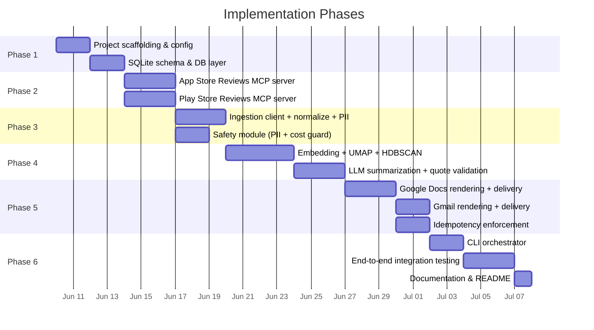
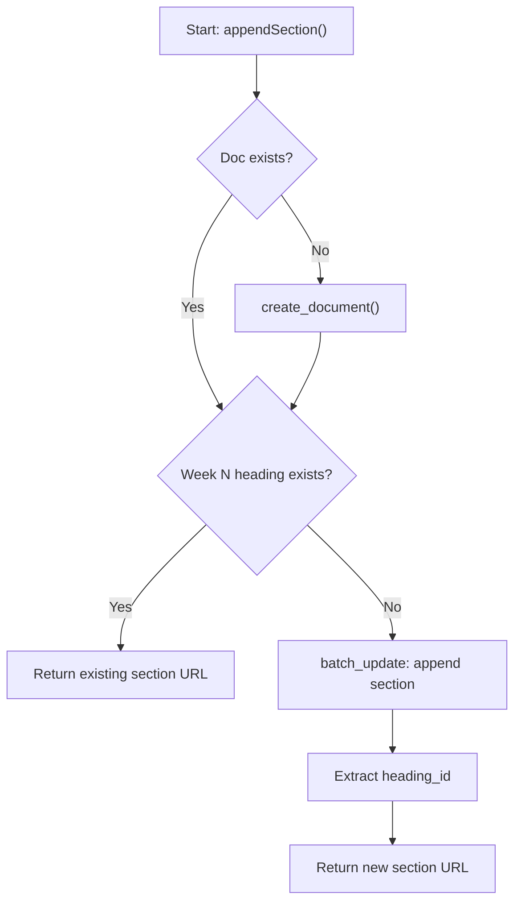
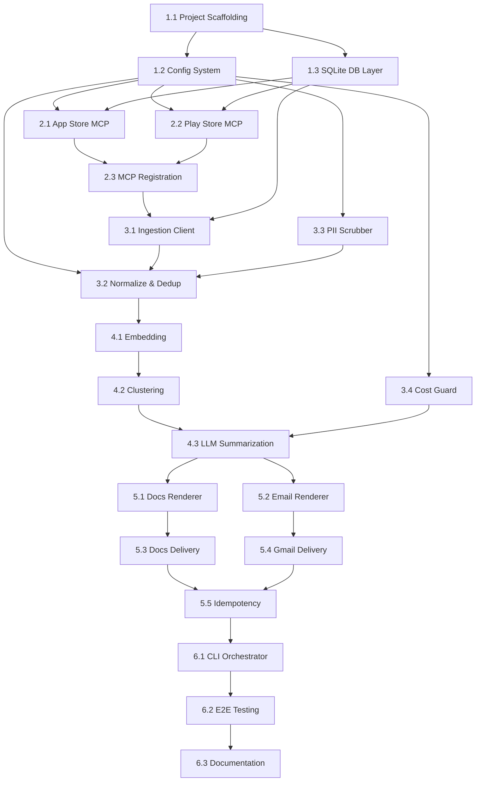

# Weekly Product Review Pulse — Implementation Plan

> **References:**
> - [problemStatement.md](file:///d:/App%20Review%20AI/docs/problemStatement.md)
> - [architecture.md](file:///d:/App%20Review%20AI/docs/architecture.md)
>
> **Target product:** Groww
> **Last updated:** 2026-06-09

---

## Plan Overview

The implementation is divided into **6 phases**, ordered by dependency chain. Each phase produces a working, testable artifact before the next begins. The critical path runs bottom-up: infrastructure → MCP servers → ingestion → analysis → delivery → integration.



---

## Phase 1 — Foundation & Infrastructure

> **Goal:** Project scaffolding, configuration system, and persistent storage — everything the later phases build on.

### 1.1 Project Scaffolding

| Task | Detail |
|---|---|
| Initialize root `package.json` | TypeScript project with workspaces for `mcp-servers/*` and `src/` |
| Configure TypeScript | `tsconfig.json` with strict mode, ESM output, path aliases |
| Install core dependencies | `better-sqlite3`, `commander` (CLI), `zod` (validation), `dotenv` |
| Set up linting/formatting | ESLint + Prettier with consistent config |

**Files created:**

```
App Review AI/
├── package.json
├── tsconfig.json
├── tsconfig.base.json
├── .eslintrc.json
├── .prettierrc
├── .env.example
└── .gitignore
```

**Acceptance criteria:**
- [ ] `npm install` completes without errors
- [ ] `npx tsc --noEmit` passes
- [ ] Workspace structure resolves `mcp-servers/*` packages

---

### 1.2 Configuration System

| Task | Detail |
|---|---|
| Create `src/config.ts` | Centralized config with Zod schema validation |
| Environment variable overrides | Every config key overridable via `PULSE_*` env vars |
| Groww-specific defaults | App IDs, time window, LLM model, delivery mode |

**Config keys** (from [architecture.md §8](file:///d:/App%20Review%20AI/docs/architecture.md)):
- `product`, `appStore.appId`, `playStore.appId`
- `reviewWindowWeeks`, `topKClusters`
- `llm.model`, `llm.maxInputTokensPerCall`, `llm.maxTotalTokensPerRun`
- `delivery.mode` (`"draft"` | `"send"`), `delivery.docTitle`, `delivery.emailRecipients`
- `safety.maxReviewsToIngest`, `safety.piiScrubEnabled`
- `db.path`

**Acceptance criteria:**
- [ ] Config loads from `.env` + falls back to defaults
- [ ] Invalid config values throw clear Zod errors at startup

---

### 1.3 SQLite Database Layer

| Task | Detail |
|---|---|
| Create `src/db/schema.sql` | `run_log` table + `reviews` table |
| Create `src/db/store.ts` | Typed CRUD operations using `better-sqlite3` |
| Auto-migration on startup | Schema applied if `pulse.db` doesn't exist |

**Tables:**

```sql
-- Run log (idempotency + audit)
CREATE TABLE run_log (
    id              INTEGER PRIMARY KEY AUTOINCREMENT,
    product         TEXT NOT NULL,
    iso_year        INTEGER NOT NULL,
    iso_week        INTEGER NOT NULL,
    run_started_at  TEXT NOT NULL,
    run_finished_at TEXT,
    status          TEXT NOT NULL CHECK(status IN ('running','success','failed','partial')),
    reviews_fetched INTEGER,
    clusters_found  INTEGER,
    doc_id          TEXT,
    doc_heading_id  TEXT,
    doc_section_url TEXT,
    email_message_id TEXT,
    email_mode      TEXT CHECK(email_mode IN ('sent','draft','skipped')),
    error_message   TEXT,
    UNIQUE(product, iso_year, iso_week)
);

-- Cached reviews (audit trail + re-analysis)
CREATE TABLE reviews (
    id          INTEGER PRIMARY KEY AUTOINCREMENT,
    review_id   TEXT NOT NULL,
    source      TEXT NOT NULL CHECK(source IN ('app_store','play_store')),
    app_id      TEXT NOT NULL,
    rating      INTEGER NOT NULL,
    title       TEXT,
    body        TEXT NOT NULL,
    raw_body    TEXT NOT NULL,
    date        TEXT NOT NULL,
    version     TEXT,
    country     TEXT,
    fetched_at  TEXT NOT NULL,
    iso_year    INTEGER NOT NULL,
    iso_week    INTEGER NOT NULL,
    UNIQUE(source, review_id)
);
```

**Acceptance criteria:**
- [ ] `pulse.db` auto-created on first run with both tables
- [ ] `store.ts` exports typed functions: `insertRun`, `updateRun`, `getRun`, `insertReviews`, `getReviewsByWeek`
- [ ] Duplicate `(source, review_id)` inserts are handled gracefully (upsert/ignore)

---

## Phase 2 — MCP Review Servers

> **Goal:** Two fully functional MCP servers that the agent can call to fetch Groww reviews from Apple App Store and Google Play.

### 2.1 App Store Reviews MCP

| Task | Detail |
|---|---|
| MCP server setup | Use `@modelcontextprotocol/sdk` to create a stdio-based MCP server |
| `get_reviews` tool | Fetches from iTunes RSS JSON endpoint, paginates, returns `Review[]` |
| `get_app_info` tool | Fetches app metadata (name, rating, version) |
| Rate limiting | Respect Apple's public RSS rate limits (add configurable delay between pages) |
| Error handling | Graceful handling of 404, rate-limit, and malformed JSON |

**Key implementation details:**

```
Data source: https://itunes.apple.com/{country}/rss/customerreviews/id={app_id}/sortBy=mostRecent/page={page}/json
Groww App Store ID: 1404684361
Max pages: 10 (each page ≈ 50 reviews = ~500 reviews max)
```

**Files:**

```
mcp-servers/appstore-reviews/
├── src/
│   ├── server.ts          # MCP server entry, registers tools
│   ├── tools.ts           # Tool definitions with Zod input schemas
│   ├── client.ts          # iTunes RSS HTTP fetch + JSON parsing
│   └── types.ts           # Review, AppInfo interfaces
├── package.json
├── tsconfig.json
└── __tests__/
    ├── client.test.ts     # Unit tests with mocked HTTP
    └── tools.test.ts      # Tool integration tests
```

**Acceptance criteria:**
- [ ] `get_reviews` returns valid `Review[]` for Groww's App Store ID
- [ ] Pagination works (fetches up to 10 pages)
- [ ] Server starts via `npx tsx src/server.ts` and responds to MCP tool calls
- [ ] Unit tests pass with mocked HTTP responses
- [ ] Handles edge cases: empty page, malformed entry, network timeout

---

### 2.2 Play Store Reviews MCP

| Task | Detail |
|---|---|
| MCP server setup | Stdio-based MCP server using `@modelcontextprotocol/sdk` |
| `get_reviews` tool | Uses `google-play-scraper` npm package, returns `Review[]` |
| `get_app_info` tool | Fetches app metadata |
| Pagination | Supports `count` parameter (default 200, max 2000) |
| Error handling | Graceful handling of scraping failures, CAPTCHA blocks |

**Key implementation details:**

```
Package: google-play-scraper (npm)
Groww Play Store ID: com.nextbillion.groww
Default count: 200 reviews per call
Sort options: newest, rating, helpfulness
```

**Files:**

```
mcp-servers/playstore-reviews/
├── src/
│   ├── server.ts          # MCP server entry, registers tools
│   ├── tools.ts           # Tool definitions with Zod input schemas
│   ├── scraper.ts         # google-play-scraper wrapper
│   └── types.ts           # Review, AppInfo interfaces
├── package.json
├── tsconfig.json
└── __tests__/
    ├── scraper.test.ts    # Unit tests with mocked scraper
    └── tools.test.ts      # Tool integration tests
```

**Acceptance criteria:**
- [ ] `get_reviews` returns valid `Review[]` for Groww's Play Store ID
- [ ] `count` parameter correctly limits results
- [ ] Server starts and responds to MCP tool calls
- [ ] Handles scraper failures gracefully (returns error, doesn't crash)
- [ ] Unit tests pass with mocked scraper responses

---

### 2.3 MCP Server Registration

| Task | Detail |
|---|---|
| Create MCP config file | Register both servers so the agent core can discover them |
| Startup verification | CLI validates both MCP servers are reachable before pipeline starts |

**MCP configuration** (e.g. in project root or `~/.mcp/`):

```json
{
  "mcpServers": {
    "appstore-reviews": {
      "command": "npx",
      "args": ["tsx", "mcp-servers/appstore-reviews/src/server.ts"]
    },
    "playstore-reviews": {
      "command": "npx",
      "args": ["tsx", "mcp-servers/playstore-reviews/src/server.ts"]
    }
  }
}
```

**Acceptance criteria:**
- [ ] Both servers are discoverable by the agent via MCP protocol
- [ ] Server health check on CLI startup (list tools, verify response)

---

## Phase 3 — Ingestion & Safety

> **Goal:** Fetch reviews from both MCP servers, normalize into a unified schema, deduplicate, scrub PII, and persist to SQLite.

### 3.1 Ingestion Client

| Task | Detail |
|---|---|
| Create `src/ingestion/ingest.ts` | Calls both review MCP servers in parallel, merges results |
| MCP client setup | Use `@modelcontextprotocol/sdk` client to call tool endpoints |
| Time window filter | Drop reviews older than `reviewWindowWeeks` from run date |
| Raw storage | Persist raw reviews to SQLite before any transformation |

**Acceptance criteria:**
- [ ] Fetches reviews from both MCP servers concurrently
- [ ] Filters to configured time window
- [ ] Returns a merged `RawReview[]` array with source metadata
- [ ] Persists raw reviews for audit trail

---

### 3.2 Normalization & Deduplication

| Task | Detail |
|---|---|
| Create `src/ingestion/normalize.ts` | Maps both source schemas → unified `Review` interface |
| Deduplication | Uses `(source, review_id)` as composite key; skips already-seen reviews |
| Date normalization | All dates → ISO 8601 UTC |
| Field mapping | Play Store: `thumbs_up` → ignored; `reply_text` → ignored; `title` → nullable |

**Acceptance criteria:**
- [ ] Both source schemas correctly map to unified `Review`
- [ ] Duplicate reviews across runs are not re-inserted
- [ ] All dates are valid ISO 8601

---

### 3.3 PII Scrubber

| Task | Detail |
|---|---|
| Create `src/safety/pii-scrubber.ts` | Regex-based scrubbing of emails, phone numbers, URLs |
| Scrub function | `scrubPII(text: string): { scrubbed: string; redactions: number }` |
| Applied at | Stage 2 (before clustering/LLM) and verified at Stage 5 (before publishing) |
| Configurable | `safety.piiScrubEnabled` toggle in config |

**Regex patterns:**

| Pattern | Regex |
|---|---|
| Email | `\b[A-Za-z0-9._%+-]+@[A-Za-z0-9.-]+\.[A-Z]{2,}\b` (case-insensitive) |
| Phone (Indian) | `\b(\+91[\s-]?)?[6-9]\d{4}[\s-]?\d{5}\b` |
| Phone (International) | `\b\+?\d{1,3}[-.\s]?\(?\d{2,4}\)?[-.\s]?\d{3,4}[-.\s]?\d{3,4}\b` |
| URLs | `https?://\S+` |

**Acceptance criteria:**
- [ ] Emails like `user@gmail.com` → `[REDACTED]`
- [ ] Phone numbers like `+91 98765 43210` → `[REDACTED]`
- [ ] URLs like `https://example.com/path` → `[REDACTED]`
- [ ] Non-PII text is unchanged
- [ ] Returns redaction count for logging

---

### 3.4 Rate Limiter & Cost Guard (Groq Constraints)

| Task | Detail |
|---|---|
| Create `src/safety/cost-guard.ts` | Token and request rate tracker per run |
| `RateLimiter` class | Tracks requests per minute (max 30), tokens per minute (max 12K), and daily limits (1K req / 100K tokens) |
| Throttling | Pauses execution (`sleep`) if approaching the 12K TPM or 30 RPM limit, instead of just failing |
| Token estimation | Use `tiktoken` or simple word-based estimation (1 token ≈ 0.75 words) to proactively calculate cluster token size before calling Groq |

**Acceptance criteria:**
- [ ] Tracks TPM and RPM across multiple Groq LLM calls within a run
- [ ] Automatically delays execution to respect Groq's 12K TPM limit
- [ ] Enforces the absolute daily run limit of 100K tokens by safely aborting or skipping remaining clusters

---

## Phase 4 — Analysis Engine

> **Goal:** Embed reviews, cluster them into themes, and use an LLM to produce named themes with validated quotes and action ideas.

### 4.1 Sentence Embedding

| Task | Detail |
|---|---|
| Create `src/analysis/embed.ts` | Generate vector embeddings for each review's body text |
| Model options | Local **`paraphrase-multilingual-MiniLM-L12-v2`** (via `@xenova/transformers`) to properly support Hinglish / Romanized Hindi |
| Batching | Embed in batches of 100 to manage memory |
| Caching | Store embeddings in SQLite (optional, avoids re-embedding for same reviews) |

**Interface:**

```typescript
interface EmbeddingResult {
  review_id: string;
  vector: number[];     // 384-dim (MiniLM) or 1536-dim (OpenAI)
}

async function embedReviews(reviews: Review[]): Promise<EmbeddingResult[]>;
```

**Acceptance criteria:**
- [ ] Embeds 500+ reviews without exceeding rate limits
- [ ] Consistent vector dimensions across all reviews
- [ ] Handles empty or very short review bodies gracefully

---

### 4.2 Clustering (UMAP + HDBSCAN)

| Task | Detail |
|---|---|
| Create `src/analysis/cluster.ts` | Dimensionality reduction + density-based clustering |
| UMAP | Use `umap-js` npm package; n_components=5, metric=cosine, seed=42 |
| HDBSCAN | Use `hdbscanjs` or custom implementation; min_cluster_size from config |
| Ranking | Rank separately by sentiment, or use distance from neutral: `Score = cluster_size × (1 + abs(3 - avg_rating))` to ensure 5-star positive themes are not zeroed out |
| Top-K selection | Return top 5 clusters (mix of top negative and top positive themes) |

**Interface:**

```typescript
interface Cluster {
  cluster_id: number;
  review_ids: string[];
  size: number;
  centroid: number[];
  avg_rating: number;
  date_range: { earliest: string; latest: string };
}

function clusterReviews(
  embeddings: EmbeddingResult[],
  reviews: Review[],
  config: ClusterConfig
): Cluster[];
```

**Acceptance criteria:**
- [ ] Deterministic output given same input + seed
- [ ] Noise reviews (unclustered) are excluded from top-K
- [ ] Returns clusters sorted by rank score descending
- [ ] Works with as few as 50 reviews (gracefully degrades min_cluster_size)

---

### 4.3 LLM Summarization & Quote Validation

| Task | Detail |
|---|---|
| Create `src/analysis/summarize.ts` | Prompts LLM per cluster, parses structured output |
| LLM provider | **Groq** via `groq-sdk`, using model `llama-3.3-70b-versatile` |
| Review Sampling | Cap the number of reviews sent per cluster prompt (e.g. top 20 most representative) to strictly avoid hitting the 12K Tokens-Per-Minute Groq limit |
| JSON output parsing | Use Zod to validate LLM JSON response structure |
| Quote validation | Substring-match every quote against the cluster's review corpus; drop hallucinated quotes |
| Rate Limit integration | Check `RateLimiter` before each call; sleep if approaching 12K TPM or 30 RPM limits |

**Prompt template:**

```
You are analyzing app reviews for Groww.
Below are {N} reviews that share a common theme.

<reviews>
{review_texts — PII-scrubbed, one per line with review_id prefix}
</reviews>

Produce a JSON object with:
- "theme_name": string (3-6 words)
- "description": string (1-2 sentences)
- "quotes": string[] (2-3 verbatim quotes, MUST appear exactly in the reviews above)
- "action_ideas": string[] (1-2 actionable suggestions)
```

**Quote validation logic:**

```typescript
function validateQuotes(
  quotes: string[],
  reviewCorpus: Review[]
): ValidatedQuote[] {
  return quotes
    .map(q => {
      const match = reviewCorpus.find(r => r.body.includes(q));
      return match ? { text: q, review_id: match.review_id, rating: match.rating } : null;
    })
    .filter(Boolean);
}
```

**Acceptance criteria:**
- [ ] LLM returns valid JSON matching the Zod schema
- [ ] Hallucinated quotes are filtered out (not in any review body)
- [ ] At least 1 validated quote per theme (or theme is flagged as low-confidence)
- [ ] Cost guard prevents budget overrun
- [ ] Graceful retry on LLM timeout (1 retry, then skip cluster)

---

## Phase 5 — Rendering & Delivery

> **Goal:** Render the analysis into a Google Docs section and a stakeholder email, deliver both via MCP servers, and enforce idempotency.

### 5.1 Google Docs Renderer

| Task | Detail |
|---|---|
| Create `src/rendering/docs-renderer.ts` | Converts `PulseReport` → Google Docs structured content |
| Section heading | `## Week {ISO_WEEK} — {START_DATE} to {END_DATE}` |
| Body layout | Themes as H3 subheadings, bullets for quotes/actions, bold for emphasis |
| Output format | Array of Google Docs API `Request` objects (InsertText, UpdateParagraphStyle, etc.) |

**Section structure:**

```
## Week 24 — Jun 9 to Jun 15, 2026

### 📊 Summary
Analyzed {N} reviews from App Store and Play Store.

### 🔥 Top Themes

#### 1. {Theme Name}
{Description}

**Quotes:**
- "{quote 1}" — ⭐{rating}
- "{quote 2}" — ⭐{rating}

**Action Ideas:**
- {action 1}
- {action 2}

[... repeat for each theme ...]

---
Generated by Weekly Review Pulse on {timestamp}
```

**Acceptance criteria:**
- [ ] Output renders correctly when appended to a Google Doc
- [ ] Heading IDs are stable and predictable for deep-linking
- [ ] Handles 1–10 themes gracefully

---

### 5.2 Email Renderer

| Task | Detail |
|---|---|
| Create `src/rendering/email-renderer.ts` | Converts `PulseReport` → HTML email |
| Template | Responsive HTML email with inline CSS |
| Content | Top themes as bullet summary, review count, "Read full report →" CTA button |
| Plain text fallback | Text-only version for clients that don't render HTML |

**Email structure:**

```
Subject: Groww Review Pulse — Week 24

Body (HTML):
┌──────────────────────────────┐
│  📊 Groww Review Pulse       │
│  Week 24 — Jun 9–15, 2026   │
│                              │
│  We analyzed {N} reviews.    │
│                              │
│  Top themes this week:       │
│  • App performance & bugs    │
│  • Customer support friction │
│  • UX & feature gaps         │
│                              │
│  [Read full report →]        │
│  (links to Google Doc)       │
└──────────────────────────────┘
```

**Acceptance criteria:**
- [ ] HTML renders correctly in Gmail, Outlook, Apple Mail
- [ ] CTA button links to the correct Doc section heading
- [ ] Plain text fallback is readable
- [ ] Subject line follows template: `Groww Review Pulse — Week {ISO_WEEK}`

---

### 5.3 Google Docs Delivery

| Task | Detail |
|---|---|
| Create `src/delivery/docs-delivery.ts` | Interacts with Google Docs MCP server |
| `ensureDocument` | Check if pulse doc exists; create if not |
| `checkSectionExists` | Parse doc headings for idempotency |
| `appendSection` | Call `batch_update` with rendered content |
| `getSectionLink` | Extract heading ID, construct deep link URL |

**Idempotency flow:**



**Acceptance criteria:**
- [ ] First run creates the doc and appends section
- [ ] Second run for the same week detects existing heading and skips
- [ ] Returns a valid `https://docs.google.com/document/d/{id}/edit#heading=h.{heading_id}` URL
- [ ] Handles MCP server errors with retry (3 attempts)

---

### 5.4 Gmail Delivery

| Task | Detail |
|---|---|
| Create `src/delivery/email-delivery.ts` | Interacts with Gmail MCP server |
| `sendPulseEmail` | Sends or drafts depending on `delivery.mode` config |
| Idempotency | Check `run_log` for existing `email_message_id` before sending |
| Recipients | From `delivery.emailRecipients` config |

**Acceptance criteria:**
- [ ] `mode: "draft"` creates a draft via `create_draft` tool
- [ ] `mode: "send"` sends via `send_email` tool
- [ ] Duplicate runs do not send duplicate emails
- [ ] Returns `message_id` or `draft_id` for run log

---

### 5.5 Idempotency Enforcement

| Task | Detail |
|---|---|
| Run-level guard in orchestrator | Check `run_log` for `(groww, iso_year, iso_week)` before starting |
| Doc-level guard in docs-delivery | Parse headings before appending |
| Email-level guard in email-delivery | Check `email_message_id` in run_log |
| Status handling | Partial runs (doc OK, email failed) can be retried |

**Acceptance criteria:**
- [ ] `pulse-cli run` on the same week twice → second run is a no-op with clear log message
- [ ] Partial run (doc succeeded, email failed) → re-run sends email only
- [ ] `run_log` accurately reflects final state

---

## Phase 6 — CLI & Integration

> **Goal:** Wire everything together in the CLI orchestrator, run end-to-end tests, and produce documentation.

### 6.1 CLI Orchestrator

| Task | Detail |
|---|---|
| Create `src/cli.ts` | Entry point using `commander` |
| `run` command | Execute full pipeline for current ISO week |
| `backfill` command | Execute for a specific `--year` + `--week` |
| `status` command | Pretty-print recent run_log entries |
| `--dry-run` flag | Run pipeline but skip delivery stage |
| `--mode` flag | Override `delivery.mode` (draft/send) |
| `--verbose` flag | Enable debug logging throughout |
| Exit codes | `0` = success, `1` = failure, `2` = partial (doc OK, email failed) |

**Pipeline orchestration order:**

```
1. Load config
2. Initialize DB (auto-migrate if needed)
3. Check idempotency (run_log)
4. Start MCP servers (verify health)
5. Ingest reviews (MCP calls)
6. Normalize + deduplicate + PII scrub
7. Embed reviews
8. Cluster (UMAP + HDBSCAN)
9. LLM summarize (with quote validation)
10. Render report (Docs + Email formats)
11. Deliver to Google Docs (MCP)
12. Deliver to Gmail (MCP)
13. Update run_log (success/partial/failed)
14. Print summary
```

**Acceptance criteria:**
- [ ] `pulse-cli run` executes the full pipeline end-to-end
- [ ] `pulse-cli backfill --year 2026 --week 20` runs for a past week
- [ ] `pulse-cli status` shows a formatted table of recent runs
- [ ] `--dry-run` produces report to stdout without delivery
- [ ] Clear error messages on failure with actionable suggestions

---

### 6.2 End-to-End Integration Testing

| Test | What It Validates |
|---|---|
| **MCP server smoke test** | Both review servers start, respond to `list_tools`, return reviews for Groww |
| **Ingestion integration** | Reviews fetched, normalized, deduplicated, PII-scrubbed, stored in SQLite |
| **Clustering pipeline** | Embeddings generated, UMAP reduces, HDBSCAN clusters, top-K returned |
| **LLM round-trip** | Prompt sent, JSON parsed, quotes validated, themes created |
| **Docs delivery mock** | Rendered content is structurally valid for Google Docs API |
| **Email delivery mock** | HTML email renders correctly, CTA link is valid |
| **Idempotency** | Double-run produces no duplicates in DB, Docs, or Gmail |
| **Dry-run mode** | Full pipeline runs, no delivery calls made |
| **Error recovery** | Simulated MCP failure → retry → graceful degradation |

**Testing approach:**

| Layer | Strategy |
|---|---|
| Unit tests | Jest with mocked HTTP/MCP responses |
| Integration tests | Real MCP server calls against live App Store / Play Store (Groww) |
| Delivery tests | Mock Google Docs / Gmail MCP servers (local stubs) |
| E2E test | Full pipeline with `--dry-run` against real reviews |

**Acceptance criteria:**
- [ ] All unit tests pass (`npm test`)
- [ ] Integration test successfully fetches ≥50 Groww reviews from each store
- [ ] E2E dry-run completes without errors and produces valid report JSON
- [ ] Idempotency test confirms no-op on second run

---

### 6.3 Documentation

| Document | Content |
|---|---|
| `README.md` | Project overview, quick start, architecture summary, CLI usage |
| `docs/architecture.md` | Updated with any deviations from initial plan |
| `CONTRIBUTING.md` | Dev setup, testing guide, PR conventions |
| `mcp-servers/*/README.md` | Per-server docs: tools, schemas, usage examples |

**Acceptance criteria:**
- [ ] New developer can set up and run `pulse-cli run --dry-run` using only `README.md`
- [ ] All MCP server tools are documented with example inputs/outputs

---

## Dependency Graph

The following diagram shows the build-order dependencies between all major tasks:



---

## Risk Register

| Risk | Impact | Likelihood | Mitigation |
|---|---|---|---|
| Apple RSS feed rate-limited or deprecated | Ingestion blocked for App Store | Medium | Cache aggressively; implement fallback scraper; monitor feed availability |
| Play Store scraping blocked (CAPTCHA) | Ingestion blocked for Play Store | Medium | Use headless browser fallback; rotate user agents; rate-limit requests |
| UMAP/HDBSCAN JS libraries immature | Poor clustering quality | Low | Fallback to k-means if density-based clustering underperforms; evaluate Python subprocess |
| LLM hallucinated quotes pass validation | Misleading report | Low | Substring match is strict; add fuzzy-match threshold (≥90% Levenshtein similarity) |
| Google Workspace MCP servers unavailable | Delivery blocked | Low | Retry with backoff; fall back to local JSON export; mark run as `partial` |
| Token cost overrun | Unexpected billing | Medium | `CostGuard` enforces hard budget per run; alert on >80% usage |

---

## Success Metrics

| Metric | Target |
|---|---|
| Reviews ingested per run | ≥200 from each store (≥400 total) |
| Themes identified | 3–7 meaningful themes per run |
| Quote validation rate | ≥80% of LLM-returned quotes pass validation |
| Pipeline execution time | <5 minutes end-to-end |
| Idempotency | 0 duplicate sections or emails across 10 re-runs |
| PII leakage | 0 PII tokens in published report |
